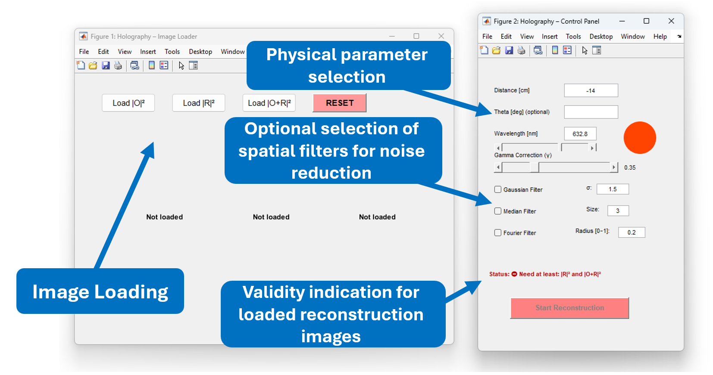
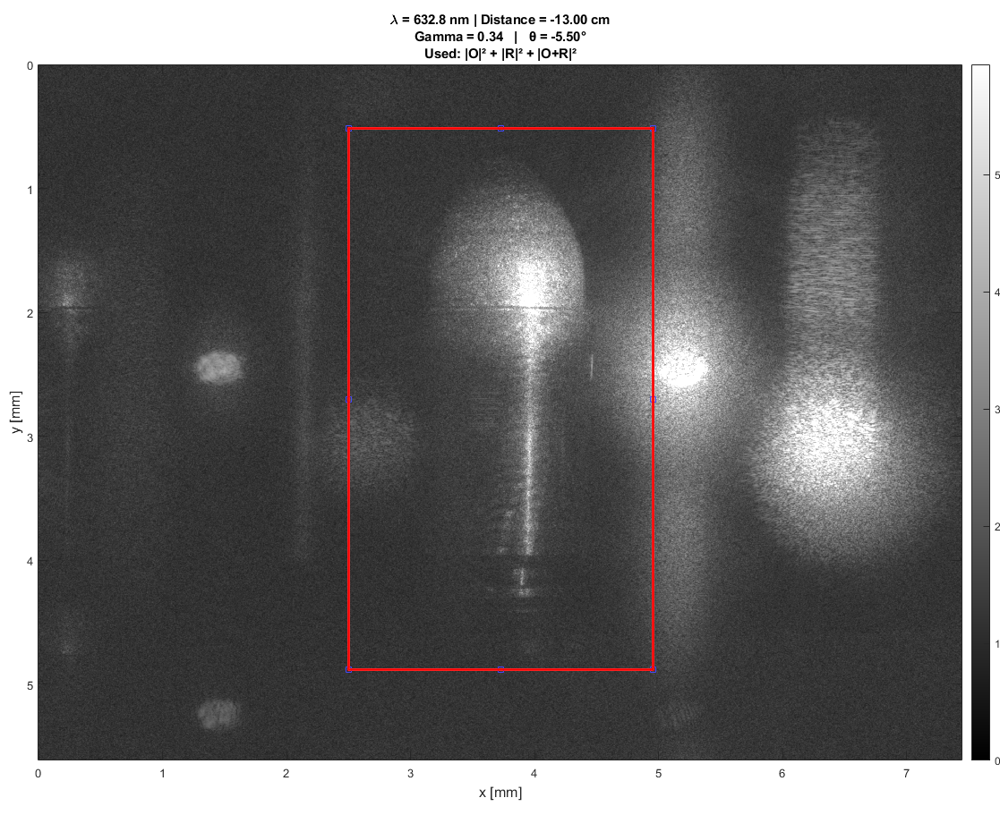
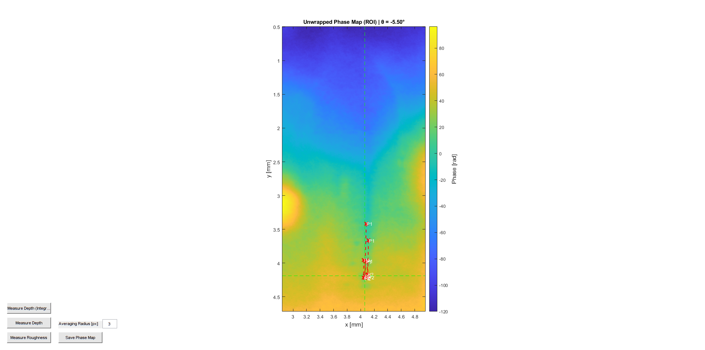

<div align="center">

# 🔬 Digital Holography Reconstruction Tool


**A complete workflow for reconstructing digital holograms using Off-Axis Fresnel Back-Propagation**

[Overview](#overview) • [Features](#features) • [How to Run](#how-to-run-demo) • [Results](#results)

</div>

---

## Overview

This project was developed as part of an advanced physics laboratory course at **Ben-Gurion University of the Negev**.  
It provides a complete workflow for reconstructing **amplitude** and **phase** information from digital holograms.



The tool features a graphical user interface (GUI) that allows users to:

- Load interference patterns
- Tune physical parameters in real time (propagation distance, wavelength, reference angle)
- Perform quantitative 3D surface measurements

---

## Features

- 📦 **Data Loading**  
  Dedicated interface for loading:
  - Object image: \( |O|^2 \)
  - Reference image: \( |R|^2 \)
  - Hologram image: \( |O + R|^2 \)

- 🎛️ **Real-Time Control**  
  Interactive control over:
  - Reconstruction distance \( d \)
  - Wavelength \( \lambda \)
  - Reference angle \( \theta \)

- 📐 **Dual Reconstruction Output**  
  - **Amplitude** (intensity) reconstruction  
  - **Phase** (topography) reconstruction

- 🔄 **Phase Unwrapping**  
  Integrated Least-Squares (LSQ) phase unwrapping for accurate 3D depth estimation

- 🛠️ **Analysis Tools**  
  ROI selection and RMS surface roughness calculation

---

## How to Run (Demo)

1. Clone the repository and add all folders to your MATLAB path.
2. Run the loader script.
3. In the loader window, select the images from the `data/` folder.
4. Click **Start Reconstruction**.
5. In the Control Panel, use the parameters provided with the demo dataset.

---

## Results

### Amplitude Reconstruction



*Clear reconstruction of the object intensity, successfully removing the DC term and twin image.*

---

### 3D Phase Map (Bullet Casing)



*Topographical reconstruction of a 9 mm bullet casing, revealing surface depth variations.*

---

## Future Improvements

- Optimization for smoother live rendering while adjusting control sliders
- Automatic focus detection to estimate the optimal reconstruction distance

---

## Credits & References

- **Author:** Eden Banim — Ben-Gurion University of the Negev
- **Phase Unwrapping Algorithm:**  
  Muhammad F. Kasim (University of Oxford, 2016), based on the work of Ghiglia & Romero

---

## File Structure

```text
├── src/        # Core reconstruction logic and GUI scripts
├── utils/      # Helper algorithms (e.g., phase unwrapping)
├── assets/     # Screenshots and documentation images
└── data/       # Link or placeholder for demo datasets
